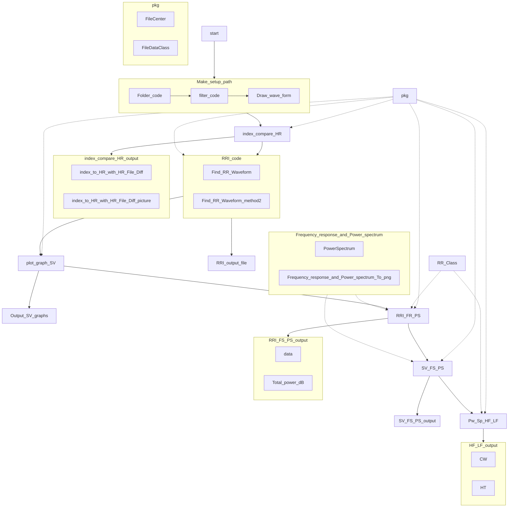

# Signal and system Final Project 2022
#### Written by KYLiN and MP Liew

---

## Master
We are using `Python` and `LabView` to develop the final project 

----
## Download 
#### ***Zip***
You can click `Code` -> `Download Zip` to download a zip file

#### ***Git*** 

You can download using git , copy this command 

`git clone https://github.com/KeithLin724/Signal-and-system-final-project-2022`

----
# Flow Chart

